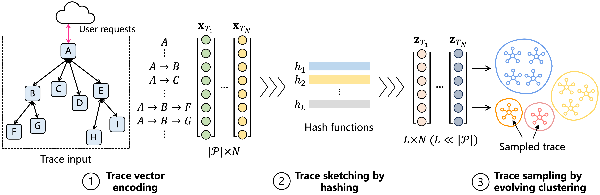

## TraceMesh: Scalable and Streaming Sampling for Distributed Traces

This is the replication package for [CLOUD'24] [TraceMesh: Scalable and Streaming Sampling for Distributed Traces]().

In this paper, we propose **TraceMesh**, a scalable and streaming trace sampler.




### Repository Organization 

```
├── docs/
├── datasets/online_boutique
│   ├── train.csv # The training trace dataset
│   ├── test.tar.gz # The compressed test trace dataset
│   └── test_label.txt # The id of annotated uncommon traces
├── src/
│   ├── DenStream/ # The modified implementation of DenStream
│   ├── path_vector.py # The implementation of path vector construction
│   ├── sketch.py # The implementation of sketch construction
│   ├── read_trace.py # The implementation of trace reading
│   └── trace_mesh.py # The main interface of TraceMesh algorithm
├── requirements.txt
└── README.md
```

### Quick Start

#### Installation

1. Install [python >= 3.9](https://www.python.org/downloads/).

2. Install the dependency needed by *TraceMesh* with the following command.

​```pip install -r requirements.txt```

#### Data Preparation

We have collected, processed and cleaned the trace data from the `online_boutique` system for demonstration purposes.
The trace data is available in the form of CSV files within the `datasets/` directory.
By replacing the data in the same format, one can seamlessly adapt *TraceMesh* to another system.

To begin, please decompress the `test.tar.gz` file in order to obtain the original test trace file named `test.csv`.

```bash
cd datasets/online_boutique
tar -xzvf test.tar.gz
```

#### Demo Execution

- Run *TraceMesh*

```bash
cd src
python trace_mesh.py
```

- Explanations of parameters:

```bash
usage: trace_mesh.py [-h] [--sketch_length SKETCH_LENGTH] [--eps EPS] [--data_path DATA_PATH] [--dataset DATASET] [--budget BUDGET]

options:
  --sketch_length SKETCH_LENGTH     Length of the sketch (default: 100)
  --eps EPS                         Epsilon value for clustering (default: 0.1)
  --data_path DATA_PATH             Path to the dataset (default: "../datasets/")
  --dataset DATASET                 Name of the dataset (default: "online_boutique")
  --budget BUDGET                   Budget for the sampling (default: 0.01)
```